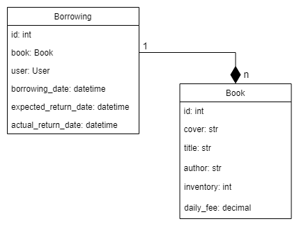

# RDF Library API

Service for borrowing and tracking inventory of books.

## Installation

Python3 must be already installed.

```shell
git clone https://github.com/vlodek69/drf-library
cd drf-library
python -m venv venv
venv\Scripts\activate (on Windows)
source venv/bin/activate (on macOS)
```

Copy .env-sample -> .env and populate with all required data.

```shell
pip install -r requirements.txt
python manage.py migrate
python manage.py createsuperuser
python manage.py runserver
```

See the documentation on `/api/swagger/` endpoint.

## Features:
- Users are able ri register using email and password.
- Authentication implemented using JWT.
- Users are able to browse books, create and return borrowings.
- Users are able to filter their borrowings by active status.
- Upon creation of new borrowing Telegram message with borrowing information is sent to configured chat for notification.
- Admin users have CRUD implementation to manage books.
- Admin users are able to filter all borrowings by user.
- Swagger UI documentation.

## Diagram


